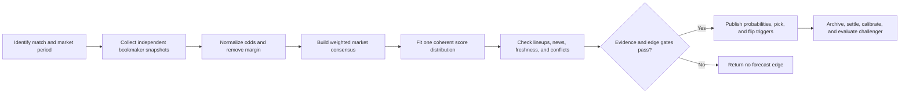

<div align="center">

# Evo-Match

**A bilingual, evidence-gated football forecasting skill built around multi-book odds, Asian handicaps, live match state, and controlled post-match evolution.**

[中文](README.zh-CN.md) | English

[](SKILL.md)
[](https://www.python.org/)
[](#development)
[](LICENSE)

[Features](#features) · [How It Works](#how-it-works) · [Install](#installation) · [Usage](#quick-start) · [Evolution](#controlled-evolution) · [Safety](#evidence-and-safety)

</div>

Evo-Match turns market data into reproducible football forecasts without pretending that odds guarantee outcomes. It combines de-vigged 1X2 prices, Asian handicap, totals, BTTS, exact-score consistency, team news, and synchronized live data. When the evidence is weak or contradictory, it returns **no forecast edge** instead of forcing a pick.

The canonical skill name remains `world-cup-2026-predictor` for compatibility, while the project covers international and club football in both English and Chinese.

## Features

| Capability | What Evo-Match does |
| --- | --- |
| Multi-book consensus | Deduplicates underlying bookmakers, removes margin, and weights independent current quotes. |
| European and Asian markets | Reconciles 1X2, Asian handicap, totals, BTTS, qualification, and correct-score markets in one score model. |
| Rolling forecasts | Supports Opening, T-3h10, T-2h10, T-1h10, and T-10min snapshots with explicit revision tracking. |
| Live-match validation | Synchronizes Sofascore match state with HKJC markets and fails closed on stale, suspended, or conflicting data. |
| News confirmation | Separates official information, credible unconfirmed reporting, and public narrative; later prices must confirm material news. |
| Post-match review | Settles 90-minute, qualification, handicap, totals, BTTS, and correct-score markets in their declared periods. |
| Controlled evolution | Evaluates challengers through grouped walk-forward testing, holdout gates, calibration metrics, and reversible profile promotion. |
| Bilingual output | English input receives English output; Chinese input receives Chinese output. |

## How It Works



The model does not treat a bookmaker as knowing the final result. Market movement is observable evidence about pricing and information flow, not proof of manipulation.

## Installation

### Install directly from GitHub

```bash
openclaw skills install git:YoujunZhao/Evo-Match@main --global
```

For a workspace-only installation, omit `--global`.

### Install from ClawHub

After the ClawHub release is available:

```bash
openclaw skills install @youjunzhao/world-cup-2026-predictor --global
```

Requirements: Python 3.10 or newer. The forecasting scripts use only the Python standard library.

## Quick Start

Ask naturally in either supported language:

```text
Use $world-cup-2026-predictor to analyze tonight's France vs Spain match.
```

```text
使用 $world-cup-2026-predictor 分析今晚法国对西班牙的比赛，并比较欧赔、亚盘和大小球。
```

Run a reproducible forecast from a multi-book snapshot:

```bash
python3 scripts/forecast.py \
  --input examples/multi-book-match.json \
  --data-dir ~/.football-forecaster \
  --pretty
```

Generate the four standard pre-kickoff alert times:

```bash
python3 scripts/kickoff_alerts.py \
  --input matches.json \
  --timezone Asia/Hong_Kong \
  --minutes-before 190 130 70 10
```

## Market Model

Evo-Match keeps related markets distinct while forcing them to describe one plausible match:

- **1X2 / moneyline:** de-vigged 90-minute home, draw, and away probabilities.
- **Qualification:** separate from the 90-minute result when extra time or penalties apply.
- **Asian handicap:** cover probability and line strength, not a substitute label for the winner.
- **Totals and BTTS:** fitted against the same goal distribution used by 1X2.
- **Correct score:** a consistency check and scenario ladder, not the primary prediction anchor.

See [consensus-model.md](references/consensus-model.md), [market-rules.md](references/market-rules.md), and [decision-policy.md](references/decision-policy.md) for the full rules.

## Live Forecasts

After kickoff, the skill uses Sofascore for match state and HKJC for the Hong Kong in-play market. A numeric live consensus requires synchronized identity, score, period, and timestamps plus at least two additional independent bookmakers. Data conflicts, observations older than 90 seconds, or a suspended relevant market trigger an abstention.

The bundled `forecast.py` is intentionally pre-match only. It will not manufacture live probabilities from incomplete event statistics.

## Controlled Evolution

Every verified finished match can be reviewed, but one result never changes the model. Evolution requires at least 100 distinct matches overall and 30 matches in each affected bucket. Challengers change one coordinate by only `-5%` or `+5%` and must pass all holdout gates:

- at least 1% relative Brier improvement;
- no log-loss regression;
- no totals or BTTS regression when sufficiently sampled;
- at most 2% bucket regression;
- calibration-error regression no greater than 0.005.

```bash
python3 scripts/postmatch_review.py \
  --forecast examples/forecast-snapshot.json \
  --result examples/completed-match.json \
  --language en \
  --data-dir ~/.football-forecaster \
  --pretty

python3 scripts/evolve.py \
  --completed ~/.football-forecaster/completed.jsonl \
  --data-dir ~/.football-forecaster \
  --mode evaluate \
  --pretty
```

Read [postmatch-evolution.md](references/postmatch-evolution.md) before promoting or rolling back a profile.

## Evidence And Safety

- Three independent underlying bookmakers are the minimum for a full forecast; five or more are preferred.
- Odds format, market, period, line, source, and timestamp must be explicit.
- Near kickoff, no quote inside the last 60 minutes means no actionable forecast.
- Weak evidence, ambiguous identity, duplicated feeds, and contradictory markets produce **no forecast edge**.
- Confidence measures evidence quality, not certainty that a team will win.
- The project never guarantees profit, places bets, or encourages chasing losses.

## Repository Layout

```text
Evo-Match/
├── SKILL.md                 # Agent workflow and output contract
├── agents/                  # Agent-facing metadata
├── examples/                # Reproducible forecast and result inputs
├── profiles/                # Versioned default model profile
├── references/              # Market, source, decision, and evolution rules
├── scripts/                 # Forecast, review, calibration, alerts, evolution
└── tests/                   # Standard-library unittest suite
```

## Development

```bash
python3 -m unittest discover -s tests -v
python3 scripts/forecast.py --input examples/multi-book-match.json --pretty
```

No third-party Python package is required for the bundled model and tests.

## License

Released under [MIT-0](LICENSE). Use, modify, and redistribute without attribution.

## Disclaimer

Evo-Match provides probabilistic analysis for research and entertainment. Football outcomes remain uncertain, and market prices can move or be wrong. This project is not financial advice and does not guarantee betting returns.
