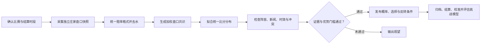

<div align="center">

# Evo-Match

**基于多公司盘口、亚洲盘、实时赛况与受控赛后进化的中英文足球预测 Skill。**

中文 | [English](README.md)

[](SKILL.md)
[](https://www.python.org/)
[](#开发与测试)
[](LICENSE)

[核心能力](#核心能力) · [预测流程](#预测流程) · [安装](#安装) · [快速使用](#快速使用) · [受控进化](#受控进化) · [证据与安全](#证据与安全)

</div>

Evo-Match 将盘口信息转换为可复现的足球概率预测，但不会把赔率包装成确定赛果。系统综合去水后的欧洲盘、亚洲让球、大小球、双方入球、正确比分一致性、阵容新闻及同步滚球数据。证据不足或盘口互相冲突时，它会明确输出 **观望**，而不是强行给出推荐。

为了兼容已有安装与调用方式，Skill 的规范名称仍为 `world-cup-2026-predictor`；项目能力已经覆盖国家队赛事和俱乐部赛事。

## 核心能力

| 能力 | Evo-Match 的处理方式 |
| --- | --- |
| 多公司盘口共识 | 按底层庄家去重、去除水位利润，并对独立且新鲜的盘口进行加权。 |
| 欧亚盘联合分析 | 用同一个比分分布校验胜平负、亚洲盘、大小球、双方入球、晋级和正确比分。 |
| 滚动预测 | 支持初盘、T-3小时10分、T-2小时10分、T-1小时10分及T-10分钟节点，并记录预测变化。 |
| 滚球数据校验 | 同步 Sofascore 赛况与 HKJC 盘口；数据过期、暂停受注或比分冲突时自动观望。 |
| 新闻确认 | 区分官方确认、可信但未确认报道与市场叙事，并用后续盘口验证重大消息。 |
| 赛后复盘 | 按市场规定分别结算90分钟、晋级、亚洲盘、大小球、双方入球与正确比分。 |
| 受控自我进化 | 通过时间顺序走查、留出集、校准指标和可回滚配置评估挑战模型。 |
| 中英文匹配 | 用户使用中文就回复中文，使用英文就回复英文。 |

## 预测流程



系统不会假设庄家预先知道赛果。盘口变化只能作为定价和信息流的可观察证据，不能被当成操控比赛的证明。

## 安装

### 从 GitHub 一键安装

```bash
openclaw skills install git:YoujunZhao/Evo-Match@main --global
```

只安装到当前工作区时，删除 `--global` 即可。

### 从 ClawHub 安装

ClawHub 版本上线后使用：

```bash
openclaw skills install @youjunzhao/world-cup-2026-predictor --global
```

运行要求：Python 3.10 或以上。核心预测脚本只使用 Python 标准库。

## 快速使用

可以直接用中文或英文提问：

```text
使用 $world-cup-2026-predictor 分析今晚法国对西班牙的比赛，并比较欧赔、亚盘和大小球。
```

```text
Use $world-cup-2026-predictor to analyze tonight's France vs Spain match.
```

使用示例盘口运行可复现预测：

```bash
python3 scripts/forecast.py \
  --input examples/multi-book-match.json \
  --data-dir ~/.football-forecaster \
  --pretty
```

生成四个标准赛前提醒时间：

```bash
python3 scripts/kickoff_alerts.py \
  --input matches.json \
  --timezone Asia/Hong_Kong \
  --minutes-before 190 130 70 10
```

## 盘口模型

- **欧洲胜平负：** 输出去水后的90分钟主胜、平局和客胜概率。
- **晋级市场：** 淘汰赛中与90分钟赛果分开，包含加时及点球影响。
- **亚洲让球：** 分析赢盘概率和盘口强度，不把赢盘直接等同于获胜。
- **大小球与双方入球：** 与胜平负共用同一个进球分布。
- **正确比分：** 只用于一致性校验和比分情景阶梯，不作为主要预测锚点。

完整规则见 [共识模型](references/consensus-model.md)、[盘口规则](references/market-rules.md)及[决策策略](references/decision-policy.md)。

## 滚球预测

开赛后，系统以 Sofascore 获取比赛分钟、比分、红黄牌、射门和 xG 等赛况，以 HKJC 获取香港滚球市场。要发布数值化滚球共识，比赛身份、比分、阶段与时间戳必须同步，并且还需至少两家独立庄家。数据超过90秒、比分冲突或相关市场暂停受注时，系统自动观望。

内置 `forecast.py` 被明确限制为赛前模型，不会使用不完整的临场统计虚构滚球概率。

## 受控进化

每场已验证比赛都可以复盘，但单场结果绝不会直接修改模型。模型进化至少需要100场不同比赛，且每个受影响分组至少30场。挑战模型每次仅允许一个参数作 `-5%` 或 `+5%` 调整，并必须通过以下留出集门槛：

- Brier 分数相对改善至少1%；
- Log Loss 不得退步；
- 样本足够时，大小球和双方入球不得退步；
- 单个分组退步不超过2%；
- 校准误差退步不超过0.005。

```bash
python3 scripts/postmatch_review.py \
  --forecast examples/forecast-snapshot.json \
  --result examples/completed-match.json \
  --language zh \
  --data-dir ~/.football-forecaster \
  --pretty

python3 scripts/evolve.py \
  --completed ~/.football-forecaster/completed.jsonl \
  --data-dir ~/.football-forecaster \
  --mode evaluate \
  --pretty
```

提升或回滚模型前，请先阅读[赛后进化规则](references/postmatch-evolution.md)。

## 证据与安全

- 完整预测至少需要三家独立底层庄家，推荐五家或以上。
- 每条报价必须明确赔率格式、市场、结算时段、盘口、来源和时间戳。
- 临近开赛时，如果最近60分钟内没有新盘口，则不发布可操作预测。
- 比赛身份不清、重复数据源、滚球不同步或盘口互相冲突时输出 **观望**。
- 置信度只表示证据质量，不表示赛果确定性。
- 不保证盈利、不代替用户下注，也不鼓励追损。

## 仓库结构

```text
Evo-Match/
├── SKILL.md                 # Agent 工作流与输出约定
├── agents/                  # Agent 元数据
├── examples/                # 可复现盘口及赛果输入
├── profiles/                # 版本化默认模型配置
├── references/              # 来源、盘口、决策和进化规则
├── scripts/                 # 预测、复盘、校准、提醒和进化脚本
└── tests/                   # Python 标准库测试
```

## 开发与测试

```bash
python3 -m unittest discover -s tests -v
python3 scripts/forecast.py --input examples/multi-book-match.json --pretty
```

内置模型和测试不依赖第三方 Python 软件包。

## 许可证

项目采用 [MIT-0](LICENSE)，允许自由使用、修改和再发布，无需署名。

## 免责声明

Evo-Match 仅提供研究和娱乐用途的概率分析。足球赛果始终存在不确定性，盘口也可能变化或定价错误。本项目不构成财务建议，也不保证任何投注回报。
